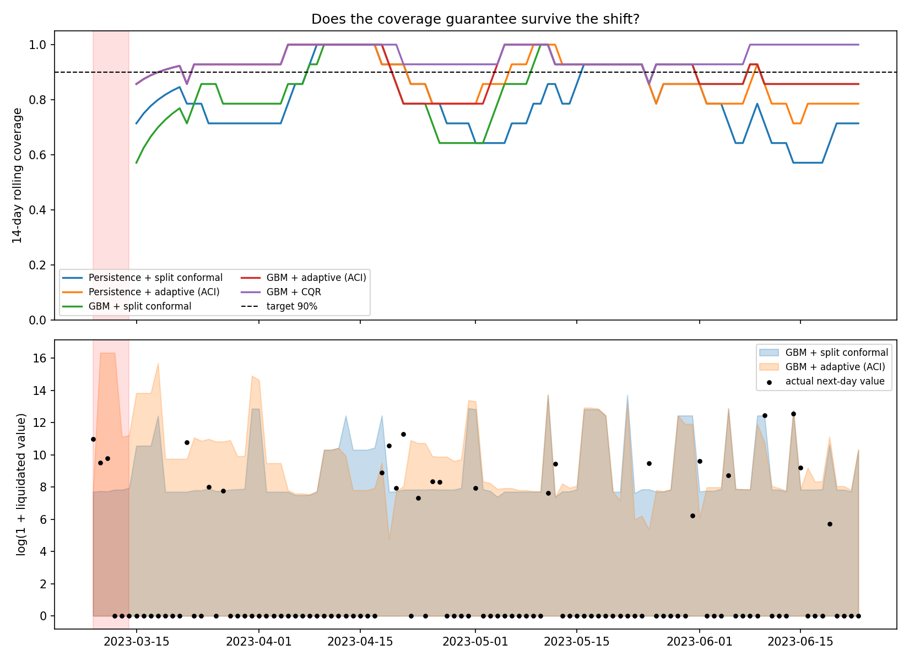

# Conformal prediction for DeFi liquidation volume

Does a conformal prediction interval keep its coverage guarantee when the market shifts? I tested this on
liquidations on Aave v3 (Ethereum): calibrate on a calm period, then test through the March 2023 SVB / USDC
depeg.



Top: rolling coverage against the 90% target. Bottom: actual daily liquidations (dots) and intervals.
The shaded band is March 9-14, 2023.

## Setup

Aave lets users borrow against deposited collateral. If a position's collateral falls too far relative to its
debt (health factor below 1), anyone can repay part of the debt and take the collateral at a discount. That
is a liquidation, and every one is a public on-chain event.

I forecast the next day's total stablecoin debt repaid through liquidations, in USD, for the whole protocol.
Inputs are recent liquidation activity only; there are no price features. The data is 104 liquidation events
from Dune (2023-01-30 to 2023-06-23). 92 of them repay stablecoin debt, which gives a USD amount directly.
The other 12 count as events but add $0.

The split is by label date: 26 training days, 11 calibration days (labels up to 2023-03-08), and 107 test
days starting at the shock. 24 of the test days have any liquidations.

## Methods

- **Split conformal:** the interval half-width is a quantile of absolute errors on the calibration set. The
  coverage guarantee needs calibration and test data to be exchangeable.
- **CQR:** conformalized quantile regression, so the width adapts to the inputs.
- **ACI:** adaptive conformal inference. After each outcome the miscoverage level is nudged, so intervals
  widen after misses.

Each runs on a persistence baseline (tomorrow = today) and a small gradient boosting model. The target is
log(1 + value), so intervals never go below zero.

## Results (90% target)

| Method | Coverage (95% CI) | Coverage on nonzero days (n=24) | Median upper bound |
|---|---|---|---|
| Persistence + split conformal | 79.4% (70-88) | 58.3% | $2.6K |
| Persistence + ACI | 88.8% (83-94) | 70.8% | $13.2K |
| GBM + split conformal | 85.0% (79-93) | 33.3% | $2.5K |
| GBM + ACI | 90.7% (85-96) | 58.3% | $13.1K |
| GBM + CQR | 95.3% (93-99) | 79.2% | $43.6K |

Confidence intervals are block bootstrap.

- Split conformal under-covers, and on days with liquidations it covers only a third. Its median upper bound
  was about $2.5K, while the first shock day had about $58K.
- ACI brings overall coverage back to 90.7% but still misses most large days. 78% of test days are zero, and
  they dominate the average.
- CQR covers nonzero days best, but a $44K upper bound against a median event of about $2.4K says little.
- Persistence does as well as gradient boosting at this training size.

## Caveats

- The sample is tiny: 24 nonzero test days, 11 calibration days, a six-day shock window. Split conformal's
  overall coverage interval (79-93%) includes 90%, so the under-coverage is suggestive, not proven.
- Daily data is autocorrelated, so exchangeability doesn't strictly hold, and the guarantee is marginal.
- The USD target covers stablecoin debt only, at $1. Collateral isn't valued.
- One chain, one Aave version, one shock. ACI's gamma and the bootstrap block length are untuned.

Next: add Aave v2 for a longer calibration window, price collateral, try regime-conditional calibration, and
repeat on another shock.

## Run

```bash
python -m venv .venv && source .venv/bin/activate
pip install -r requirements.txt
pytest
python -m defirisk.experiment   # writes outputs/results.csv and outputs/coverage.png
```

`defirisk/` has the code, `queries/` the Dune SQL, `data/` the event export (public on-chain data).

## References

Lei et al. 2018, *Distribution-free predictive inference for regression*. Romano, Patterson & Candes 2019,
*Conformalized quantile regression*. Gibbs & Candes 2021, *Adaptive conformal inference under distribution shift*.
